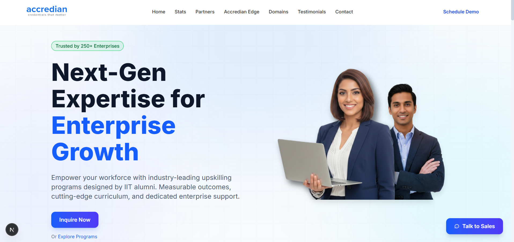

# Accredian Enterprise — Landing Page Clone

> A pixel-faithful recreation of [enterprise.accredian.com](https://enterprise.accredian.com/), built with Next.js 14, Tailwind CSS, and TypeScript.

---

## 🔗 Links

| Resource | URL |
|---|---|
| 🌐 Live Demo | [your-vercel-deployment-link.vercel.app](https://your-vercel-deployment-link.vercel.app/) *(update after deploy)* |
| 📁 GitHub Repo | [github.com/your-username/accredian-enterprise](https://github.com/your-username/accredian-enterprise) *(update link)* |

---

## 🛠️ Tech Stack

| Category | Technology |
|---|---|
| Framework | Next.js 14 (App Router) |
| Language | TypeScript |
| Styling | Tailwind CSS |
| Icons | Lucide React |
| Deployment | Vercel |
| Data | Next.js Route Handlers (Mock API) |

---

## ✅ Features Implemented

**Page Sections**
- Hero with animated CTA
- Stats bar
- Partner logos
- Accredian Edge
- Domain cards
- Course segmentation
- Target audience ("Who Should Join")
- CAT Framework
- Delivery Methodology
- FAQ accordion
- Testimonials with custom pagination
- Sticky CTA bar
- Navigation menu & footer

**Technical Highlights**
- Fully responsive across mobile, tablet, and desktop
- Mock API via Next.js Route Handlers (`/api/mock`) — FAQs, Testimonials, and Delivery Steps are dynamically fetched
- Reusable component architecture (`/components/ui` for primitives, `/components/sections` for page blocks)
- Smooth in-page anchor scrolling
- Micro-animations, scroll-fade effects, and interactive hover states

---

## ⚙️ Local Setup

**Prerequisites:** Node.js 18+, npm or yarn

```bash
# 1. Clone the repository
git clone https://github.com/your-username/accredian-enterprise.git
cd accredian-enterprise

# 2. Install dependencies
npm install

# 3. Start the development server
npm run dev
```

Open [http://localhost:3000](http://localhost:3000) in your browser.

### Available Scripts

| Command | Description |
|---|---|
| `npm run dev` | Start development server |
| `npm run build` | Create production build |
| `npm run start` | Run production server |
| `npm run lint` | Run ESLint |

---

## 🏗️ Project Structure

```
accredian-enterprise/
├── src/
│   ├── app/
│   │   ├── api/
│   │   │   └── mock/
│   │   │       └── route.ts          # Mock API for dynamic sections
│   │   ├── globals.css               # Global styles & Tailwind
│   │   ├── layout.tsx                # Root layout with providers
│   │   └── page.tsx                  # Main landing page assembly
│   ├── components/
│   │   ├── layout/                   # Global layout components
│   │   │   ├── Footer.tsx
│   │   │   └── Navbar.tsx
│   │   ├── sections/                 # Landing page content blocks
│   │   │   ├── CATFrameworkSection.tsx
│   │   │   ├── CourseSegmentationSection.tsx
│   │   │   ├── CTASection.tsx
│   │   │   ├── DomainsSection.tsx
│   │   │   ├── EdgeSection.tsx
│   │   │   ├── FAQSection.tsx
│   │   │   ├── HeroSection.tsx
│   │   │   ├── HowWeDeliverSection.tsx
│   │   │   ├── PartnersSection.tsx
│   │   │   ├── StatsSection.tsx
│   │   │   ├── TestimonialsSection.tsx
│   │   │   └── WhoShouldJoinSection.tsx
│   │   └── ui/                       # Reusable UI primitives
│   │       ├── AnimateOnScroll.tsx
│   │       ├── Badge.tsx
│   │       ├── Button.tsx
│   │       ├── Card.tsx
│   │       ├── Container.tsx
│   │       ├── Section.tsx
│   │       └── SectionHeader.tsx
│   ├── constants/                    # Static content & config
│   │   ├── content.ts
│   │   ├── navigation.ts
│   │   └── siteConfig.ts
│   ├── hooks/                        # Custom React hooks
│   ├── lib/                          # Utility functions (e.g., cn for Tailwind)
│   └── types/                        # TypeScript definitions
└── public/                           # Static assets (images, icons)
```

---

## 🧠 Approach Taken

### 1. Component-Driven Design (CDD)
The project starts with atomic UI primitives — `Button`, `Card`, `Section` — establishing a design system before any page-level section is built. This ensures visual consistency and makes future changes low-risk.

### 2. Data & Logic Separation
All static content (navigation links, domain cards, site config) is abstracted into `src/constants/`. React components contain zero hardcoded strings, keeping them purely presentational and easy to maintain or hand off to a CMS.

### 3. Mock API Integration
Rather than hardcoding dynamic sections, a simulated backend is implemented using Next.js Route Handlers (`/api/mock/route.ts`). The `FAQ`, `Testimonials`, and `How We Deliver` components fetch their data asynchronously on mount — directly mirroring a real-world data pipeline and making future CMS or backend swaps trivial.

### 4. Design Fidelity
Generic Tailwind templates were deliberately avoided. Every spacing value, shadow depth, gradient, and hover state was hand-tuned to match Accredian's branded blue/indigo palette and the premium B2B SaaS visual hierarchy of the original site.

---

## 🤖 AI Usage

AI tools were used strategically to accelerate development without replacing engineering judgment.

### Where AI Helped
- **Component scaffolding** — generating boilerplate for functional components and standard Tailwind grid/flex layouts, which were then heavily customised
- **Mock data generation** — producing realistic JSON structures (FAQs, Testimonials, Delivery Steps) for the `/api/mock` endpoint, seeded from the original site's content
- **Icon mapping** — identifying the best `lucide-react` icons to match the original site's SVG intent

### What Was Done Manually
- **Architecture decisions** — the `src/components/ui`, `src/components/sections`, `src/constants`, and `src/app/api` folder structure was designed manually for scalability, not generated
- **Design refinement** — AI UI output tends toward generic aesthetics; all Tailwind spacing, layered box-shadows, branded color tokens, and transition timing were hand-tweaked to meet a senior frontend bar
- **State & interactivity** — the FAQ accordion and Testimonials custom paginator were written and debugged manually, handling edge cases (empty states, keyboard nav) that AI-generated code missed
- **Responsive layout** — breakpoint decisions and mobile-specific layout overrides were coded manually after testing on real devices

---

## 🔮 Improvements With More Time

| Priority | Improvement |
|---|---|
| ⭐ Bonus | **Lead Capture Form** — "Request a Callback" modal connected to a Next.js API route, storing leads in Supabase or MongoDB |
| High | **Headless CMS** — Move `src/constants` content into Sanity or Strapi so marketing can self-serve copy updates |
| High | **Performance** — `next/image` with blur placeholders for all remote partner logos and heavy hero assets (improves LCP) |
| Medium | **Testing** — Jest + React Testing Library for FAQ accordion state, Testimonials pagination edge cases, and API fetch error states |
| Low | **Analytics** — Vercel Analytics or PostHog to track CTA click-through and section engagement |

---

## 🧪 Bonus Feature — Lead Capture Form

A "Request a Callback" modal is implemented as a bonus feature. It:
- Renders as a full-page overlay triggered from the sticky CTA
- Validates name, email, phone, and company fields client-side
- Submits to `/api/leads` (Next.js Route Handler)
- Stores the submission in a database


# Accredian_page

